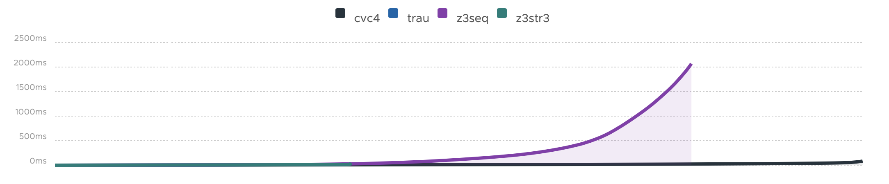
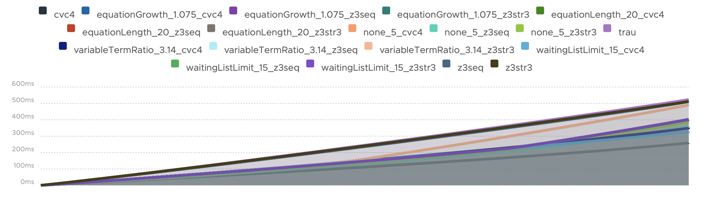

= ZaligVinder:
A string solving benchmark framework
:toc: left
:stem:

_The_ increased interest in string solving in the recent years has made
it very hard to identify the right tool to address a particular user's purpose. Firstly, there is a multitude of string solving, each addressing essentially some subset of the general problem. Generally, the addressed fragments are relevant and well motivated, but 
the lack of comparisons between the existing tools on an equal set of benchmarks cannot go unnoticed, especially as a common framework to compare solvers seems to be missing. In this paper we gather a set of relevant benchmarks and introduce our new benchmarking framework ZaligVinder to address this purpose. 

== Setting up ZaligVinder
All steps to setup this benchmark framework are discribed in the coresponding paper. 

== A short guide for the ZaligVinder WebApp
On the upper end of our web app you can choose between three categories which are explained briefly.

=== Getting Started
This is the current page. It shows you nothing more than this small guide.

=== Benchmark Summary
This pages displays a summary for all of your benchmark sets and tracks.

The sub navigation on the right hand side allows you to choose a specific track or the summary for a whole set of benchmarks. You may have to scroll down to view other tracks.

[.text-center]
image::img/subnav.png[Sub navigation]

Each page offers the user an overview table of grouped instances. The table holds the tool name, how many instances are declared as satisfiable resp. unsatisfiable, unknown instances (the solver terminates without a result before getting killed by the timeout limit), misclassification of an instance (error - currently done by a majority vote between all results of the solvers), timed out instances, the total amount within a track/set of benchmarks, and the overall solving time. 

[.text-center]
image::img/overview.png[Overview table]

The second table shows a ranking of each solver participating on a track. The grading is easily modifiable and currently is done as follows:

* Instance declared correctly: +(`#solver` / `#pos`) Points, meaning the fastest correctly classifying solver gets most of the points.
* Unknown declared instance before timeout kills the solver: +1 Point.
* Timeout: -1 Point.
* Error: -`#solver` Points.

where `#solver` is the amount of solvers being part of a benchmark set and `#pos` the position of the solver within all solvers who classified an instance correctly.

[.text-center]
image::img/ranks.png[Ranking table]

The first diagram shows a distribution for each solver distinguishing between satisfiable/unsatisfiable and timed out resp. unknown instances. 

[.text-center]
image::img/distribution.png[Distribution diagram]

The next set of diagrams show the same distribution as before as a pie diagram. This makes an easier identification possible in some cases. 

[.text-center]
image::img/pie.png[Pie diagram]

A cactus diagram follows. In these kind of plots all instances are sorted by their solving time and listed ascending as a point within a line diagram. 
The first cactus plot lists all instances of a track / benchmark set. It gives an intuition of how quick a solver classifies all instances over time. The structure of a cactus plot automatically holds all timed out instances in the end. 

[.text-center]
image::img/cactus_unk.png[Cactus plot with unknowns and errors]

Excluding the unknowns an errors gives an intuition of how quick a solver comes up with the correct answers. By clicking on a label of the graph, the user is able to active/deactivate a specific solver.

[.text-center]
image::img/cactus.png[Cactus plot w/o unknowns and errors]

=== Tool Comparison
This page offers you the opportunity to compare different solvers per instances; finding out what instances caused a good or a bad behaviour. 

The navigation between different tracks and benchmark summaries is again done using the side navigation as explained previously. 

The top box allows you to choose between the available solvers by clicking on a label. Solvers highlighted in green are part of the current comparison. You can disable them by simply clicking the x. White labelled solvers are not part of the comparison. Active them again by a click. 

[.text-center]
image::img/label.png[Tool selection]

The comparison table holds the following elements:

. The instance name - corresponding to the input file. Click on the file icon to view the instance.
. For each solver (listed in the first row of the table):
	* A Result classified by an icon.  means the solver classified the instance as satisfiable, unsatisfiable and  as unknown or timed out.
	* Time to solve the instance
	* The model. If a model is available click on the icon . The absense of a model is indicated by . Whenever a solver terminated unexpectedly we indicate this behaviour by . Click on the icon to view the solvers output.

[.text-center]
image::img/table.png[Table header]

The filter icon on the right hand side gives you the following options:

[.text-center]
image::img/filter.png[Filter view]

[start=3]
. Show unique classfied instances, that is if there is only on solver within the current view which classified the instance. The corresponding solver is marked by  resp. .

[.text-center]
image::img/uniquely.png[Uniquely classified instances]

[start=4]
. Show instances with errors, where only wrongly classified instances given the technique are displayed. The column of the wrong solver is marked again with  resp. 

[.text-center]
image::img/error.png[Errornous classified instances]

[start=5]
. Show undeclared instances lists all instances where no solver found a solution.

[.text-center]
image::img/undeclared.png[Undeclared instances]

[start=6]
. Show only instances, where the solver terminated unexpectedly.
. Only ambiguous answers is showing only instances where an error classification was not possible. This could for instance happen if we do not know the correct answer of an instance and the solvers are not agreeing.

== Availability
=== Binary
We distribute the source of ZaligVinder https://git.zs.informatik.uni-kiel.de/dbp/wordbenchmarks[here].

== A comparison on the collection of benchmarks
Within the paper we gather sets of benchmarks from literature. They are a available https://git.zs.informatik.uni-kiel.de/dbp/wordbenchmarks/tree/comparison_start/models[here].

In the following we give a small summary overview, of how four of the major string solvers, http://cvc4.cs.stanford.edu/web/[CVC4], https://github.com/Z3Prover/z3[Z3str], https://github.com/Z3Prover/z3[Z3Seq] and
https://github.com/guluchen/z3/tree/new_trau[Trau], and our tool https://www.informatik.uni-kiel.de/~mku/woorpjeLevi/[Woorpje] (on it's restricted set of features) survived.

To obtain the below results we used a server having 64 Intel(R) Xeon(R) Gold 6242 CPU @ 2.80GHz and 1.5 TB RAM running Ubuntu Linux. We compiled the master of Z3s https://github.com/Z3Prover/z3.git[GIT] on commit c816d45a7def3f7ca18fa3e94f28f7450c183a05 for Z3str3 and Z3Seq.
For Trau we used their https://github.com/guluchen/z3.git[GIT] version on commit ce850ac2751f2c3fc30e2e62ed26ffc6b9daa1f5. CVC4 was acquired as https://github.com/CVC4/CVC4/releases/download/1.7/cvc4-1.7-x86_64-linux-opt[binary].

In order to reproduce our results make sure to install the python3 libs `matplotlib`, `tabulate` and `npyscreen` by executing:

`pip3 install matplotlib tabulate npyscreen`

Afterwards setup the `toolconfig.json` file as described in the paper. To start the actual benchmark run, execute

`pytho3 ast20`

The script will create a SQLite Database file and produces a shell output.

=== Woorpje Word Equations

We created a set of benchmarks to test the abilities of our tool Woorpje. It contains 5 tracks with instances containing mostly string constraints, but also linear length constrains. Running this set on their competitors revealed its difficulty. The set is generated using several hard involved examples developed in the theoretical study of word equations.

[.text-center]
image::img/woorpje.png[cactus]

|===
|Tool name |Declared satisfiable |Declared unsatisfiable |Declared unknown |Error |Timeout |Total instances |Total time
|variableTermRatio_3.14_cvc4|611|164|0|1|34|809|1333.49
|variableTermRatio_3.14_z3str3|569|162|1|1|77|809|2937.93
|variableTermRatio_3.14_z3seq|612|164|0|1|33|809|1448.25
|waitingListLimit_15_cvc4|612|161|0|0|36|809|1320.17
|waitingListLimit_15_z3str3|571|160|1|0|77|809|2864.23
|waitingListLimit_15_z3seq|617|161|0|0|31|809|1380.54
|equationGrowth_1.075_cvc4|613|162|0|0|34|809|1350.58
|equationGrowth_1.075_z3str3|583|161|1|0|64|809|2445.48
|equationGrowth_1.075_z3seq|603|162|0|0|44|809|1722.63
|equationLength_20_cvc4|609|164|0|1|36|809|1378.36
|equationLength_20_z3str3|558|163|2|1|86|809|3154.42
|equationLength_20_z3seq|616|164|0|1|29|809|1382.88
|none_5_cvc4|602|161|2|0|44|809|1660.04
|none_5_z3str3|605|161|1|0|42|809|1603.85
|none_5_z3seq|606|161|1|0|41|809|1596.05
|z3seq|535|165|0|2|109|809|3640.26
|z3str3|446|176|23|13|164|809|5281.62
|cvc4|539|163|0|1|107|809|3417.15
|trau|562|208|0|30|39|809|1967.58
|===

=== PyEx

Reynolds et al. used the tool PyEx - a symbolic executor for Python programs - to generate a set of 25,421 bench-
marks. They used 19 target functions sampled from four popular Python packages to generate the resulting benchmark set.

The benchmarks are available https://sites.google.com/site/z3strsolver/benchmarks[here].

[.text-center]
image::img/pyex.png[cactus]

|===
|Tool name |Declared satisfiable |Declared unsatisfiable |Declared unknown |Error |Timeout |Total instances |Total time
|z3seq|6497|1369|0|0|548|8414|26246.91
|z3str3|1129|1784|444|414|5057|8414|163031.49
|cvc4|6295|1357|0|0|762|8414|32440.41
|trau|7019|1384|0|0|11|8414|5307.30
|===

=== Pisa

Zheng et al. [23] generated a set of benchmarks using constraints from real-world Java sanitizer methods which where used to evaluate the PISA system. It contains 12 complex instances including multiple different string operations like indexOf, substring as a result of the Sanitizer structure.

The benchmarks are available https://sites.google.com/site/z3strsolver/benchmarks[here].

[.text-center]
image::img/pisa.png[cactus]

|===
|Tool name |Declared satisfiable |Declared unsatisfiable |Declared unknown |Error |Timeout |Total instances |Total time
|z3seq|8|4|0|0|0|12|0.53
|z3str3|7|4|0|0|1|12|30.63
|cvc4|8|4|0|0|0|12|2.11
|trau|8|4|0|0|0|12|0.60
|===

=== Norn Benchmarks

Abdulla et al. share a set of 5 tracks consisting of queries generated during verification of string-processing programs. Each formula is rather small compared to those in other sets of
benchmarks , but makes heavy use of regular expressions containing Kleene stars. This makes it a challenging one for all solvers.

The benchmarks are available http://user.it.uu.se/~jarst116/norn/[here].

[.text-center]

|===
|Tool name |Declared satisfiable |Declared unsatisfiable |Declared unknown |Error |Timeout |Total instances |Total time
|z3seq|544|104|40|0|339|1027|12244.94
|z3str3|217|90|66|3|654|1027|20145.14
|cvc4|656|186|0|0|185|1027|5668.98
|trau|214|180|633|74|0|1027|218.54
|===

=== Trau Light

Within this set of benchmarks generated by Abdulla et al. each instance holds multiple easy, mostly unsatisfiable formulae consisting only of string constraints. The set aims for testing the ability of declaring inputs as unsatisfiable, which is in general harder than finding a solution.

Set taken from https://github.com/guluchen/z3/tree/master[here].

[.text-center]
image::img/trau.png[cactus]

|===
|Tool name |Declared satisfiable |Declared unsatisfiable |Declared unknown |Error |Timeout |Total instances |Total time
|z3seq|4|94|0|0|2|100|64.34
|z3str3|4|93|2|0|1|100|33.95
|cvc4|3|94|0|0|3|100|93.22
|trau|5|94|0|0|1|100|42.90
|===

=== Leetcode Strings

An interesting set of benchmarks shared by the https://github.com/guluchen/z3/tree/master[Trau] developers. 

[.text-center]
image::img/leetcode.png[cactus]

|===
|Tool name |Declared satisfiable |Declared unsatisfiable |Declared unknown |Error |Timeout |Total instances |Total time
|z3seq|881|1785|0|0|0|2666|98.53
|z3str3|653|1791|157|6|65|2666|2186.52
|cvc4|881|1785|0|0|0|2666|328.82
|trau|881|1785|0|0|0|2666|309.15
|===

=== IBM Appscan

Zheng et al. generated a second set of benchmarks using the output of security warnings generated by IBM Security AppScan Source Edition. They ran the tool on popular websites to obtain traces of program statements which where translated into SMT formulae. The traces reflect potentially vulnerable information flows and therefore represent common real-world constraints. The set consists of 8 instances containing string functions and disequality constraints over strings.

The benchmarks are available https://sites.google.com/site/z3strsolver/benchmarks[here].

[.text-center]
image::img/ibm.png[cactus]

|===
|Tool name |Declared satisfiable |Declared unsatisfiable |Declared unknown |Error |Timeout |Total instances |Total time
|z3seq|7|0|0|0|1|8|31.69
|z3str3|3|0|1|0|4|8|124.08
|cvc4|7|0|0|0|1|8|43.56
|trau|8|0|0|0|0|8|2.73
|===

=== Sloth Tests

A nice set of benchmarks shared by the Sloth developers. This set is available in their https://github.com/uuverifiers/sloth/tree/master/tests[GIT].

[.text-center]
image::img/stringfuzz.png[cactus]

|===
|Tool name |Declared satisfiable |Declared unsatisfiable |Declared unknown |Error |Timeout |Total instances |Total time
|z3seq|408|207|0|0|450|1065|14602.83
|z3str3|591|223|5|0|246|1065|8028.16
|cvc4|626|259|0|0|180|1065|5894.73
|trau|512|329|1|12|223|1065|7416.98
|===

=== StringFuzz Tests

Blotsky et al. introduced a tool called StringFuzz to generate and transform SMT-Lib Instances of string problems  implemented in Python. The authors share a set of benchmarks generated using their tool, which aims to address typical industrial instances, potentially challenging for solvers. The set contains 17 tracks ranging from instances containing pure string constraints to hard to solve regular expression constraints. They aim for generating instances which follow structures hard to handle by some solvers (e.g. tree-like instances).

The benchmarks are available https://sites.google.com/site/z3strsolver/benchmarks[here].

[.text-center]
image::img/stringfuzz.png[cactus]

|===
|Tool name |Declared satisfiable |Declared unsatisfiable |Declared unknown |Error |Timeout |Total instances |Total time
|z3seq|408|207|0|0|450|1065|14602.83
|z3str3|591|223|5|0|246|1065|8028.16
|cvc4|626|259|0|0|180|1065|5894.73
|trau|512|329|1|12|223|1065|7416.98
|===

=== Kaluza

Saxena et al. used their tool Kudzu, a symbolic execution framework for JavaScript, to generate more than 50,000 string solving problems. The instances were obtained by lowering JavaScript operations from real world AJAX web applications and are available on their http://webblaze.cs.berkeley.edu/2010/kaluza/[website]. The instances are build around string constraints, membership in regular languages (given as regular expressions), and inequalities involving length constraints on string variables. While the size of the formula varies per instance, the variety in the used string operations is rather small. The resulting set of benchmarks was translated by Liang et al. into the SMT-Lib format. It uses string, boolean and linear constraints together with a small amount of string operations.

The benchmarks are available https://sites.google.com/site/z3strsolver/benchmarks[here].

[.text-center]
image::img/kaluza.png[cactus]

|===
|Tool name |Declared satisfiable |Declared unsatisfiable |Declared unknown |Error |Timeout |Total instances |Total time
|z3seq|33301|11799|0|0|2184|47284|70747.60
|z3str3|32633|11832|237|32|2582|47284|84339.60
|cvc4|35235|12014|0|0|35|47284|17841.00
|trau|34856|12014|0|0|414|47284|27307.57
|===

==== Kaluza restricted to the feature set of woorpje

[.text-center]

|===
|Tool name |Declared satisfiable |Declared unsatisfiable |Declared unknown |Error |Timeout |Total instances |Total time
|variableTermRatio_3.14_cvc4|14793|0|0|0|0|14793|353.26
|variableTermRatio_3.14_z3str3|14793|0|0|0|0|14793|491.66
|variableTermRatio_3.14_z3seq|14793|0|0|0|0|14793|493.93
|waitingListLimit_15_cvc4|14793|0|0|0|0|14793|328.10
|waitingListLimit_15_z3str3|14793|0|0|0|0|14793|402.88
|waitingListLimit_15_z3seq|14793|0|0|0|0|14793|399.78
|equationGrowth_1.075_cvc4|14793|0|0|0|0|14793|328.45
|equationGrowth_1.075_z3str3|14793|0|0|0|0|14793|404.05
|equationGrowth_1.075_z3seq|14793|0|0|0|0|14793|400.11
|equationLength_20_cvc4|14793|0|0|0|0|14793|327.61
|equationLength_20_z3str3|14793|0|0|0|0|14793|403.28
|equationLength_20_z3seq|14793|0|0|0|0|14793|397.56
|none_5_cvc4|14793|0|0|0|0|14793|327.66
|none_5_z3str3|14793|0|0|0|0|14793|384.72
|none_5_z3seq|14793|0|0|0|0|14793|363.54
|z3seq|14793|0|0|0|0|14793|511.90
|z3str3|14793|0|0|0|0|14793|512.28
|cvc4|14793|0|0|0|0|14793|260.01
|trau|14793|0|0|0|0|14793|524.46
|===

=== Cashew Suite

Brennan et al. used their tool called Cashew to normalise (in terms of their tool) 18,896 by Luu et al. extracted benchmarks from the Kaluza benchmark set. By constructing this subset the authors aimed to eliminate the redundancy in the original set. The set varies between easy and difficult string constraints, with Boolean constraints, without using string operations. 

The benchmarks are available https://ieee-dataport.org/documents/benchmark-suite-integrated-approach-effective-injection-vulnerability-analysis-web[here].

[.text-center]
image::img/cashew.png[cactus]

|===
|Tool name |Declared satisfiable |Declared unsatisfiable |Declared unknown |Error |Timeout |Total instances |Total time
|z3seq|376|12|0|0|6|394|238.68
|z3str3|361|12|0|0|21|394|650.20
|cvc4|366|12|0|0|16|394|516.41
|trau|376|12|0|0|6|394|225.96
|===

=== JOACO Suite

In order to evaluate their tool JOACO, a tool to detect injection vulnerabilities, Thomé et al. created a set of 94 instances based on 11 open-source Java Web applications and security benchmarks used in literature. It displays a variety of instances containing string constraints, regular expressions and string operations.

The benchmarks are available https://ieee-dataport.org/documents/benchmark-suite-integrated-approach-effective-injection-vulnerability-analysis-web[here].

[.text-center]
image::img/joaco.png[cactus]

|===
|Tool name |Declared satisfiable |Declared unsatisfiable |Declared unknown |Error |Timeout |Total instances |Total time
|z3seq|17|20|57|0|0|94|268.17
|z3str3|17|20|57|0|0|94|6.12
|cvc4|57|21|0|0|16|94|483.21
|trau|16|21|57|1|0|94|59.68
|===

=== Stranger Benchmarks

Yu et al.  used this set of 4 real-world PHP web applications to evaluate their tool Stranger - a tool detecting and sanitizing vulnerabilities in PHP applications. Thomé et al. manually translated these instances into the SMT-Lib format. The result was a set containing string operations, regular expression membership constrains, and string constraints.

The benchmarks are available https://ieee-dataport.org/documents/benchmark-suite-integrated-approach-effective-injection-vulnerability-analysis-web[here].

[.text-center]
image::img/stranger.png[cactus]

|===
|Tool name |Declared satisfiable |Declared unsatisfiable |Declared unknown |Error |Timeout |Total instances |Total time
|z3seq|4|0|0|0|0|4|33.07
|z3str3|4|0|0|0|0|4|0.56
|cvc4|0|0|0|0|4|4|120.00
|trau|3|1|0|1|0|4|5.37
|===

=== Kausler Suite

Kausler and Sherman generated a set of benchmarks to evaluate string constraint solvers in terms of symbolic execution. The set was brought down to 120 instances by Thomé et al. It contains constrains from 8 Java programs via dynamic symbolic execution, aiming for real word application. The set mostly contains Boolean and string constraints without string operations.

The benchmarks are available https://ieee-dataport.org/documents/benchmark-suite-integrated-approach-effective-injection-vulnerability-analysis-web[here].

[.text-center]
image::img/kausler.png[cactus]

|===
|Tool name |Declared satisfiable |Declared unsatisfiable |Declared unknown |Error |Timeout |Total instances |Total time
|z3seq|119|0|0|0|1|120|75.63
|z3str3|115|0|2|0|3|120|134.76
|cvc4|120|0|0|0|0|120|41.95
|trau|120|0|0|0|0|120|9.11
|===

== People involved
- https://www.zs.informatik.uni-kiel.de/de/mitarbeiter/mitja-kulczynski[Mitja Kulczynski]
- http://flmanea.blogspot.com/[Florin Manea]
- https://www.zs.informatik.uni-kiel.de/de/mitarbeiter/nowotka[Dirk Nowotka]
- https://www.boegstedpoulsen.dk[Danny Bøgsted Poulsem]

